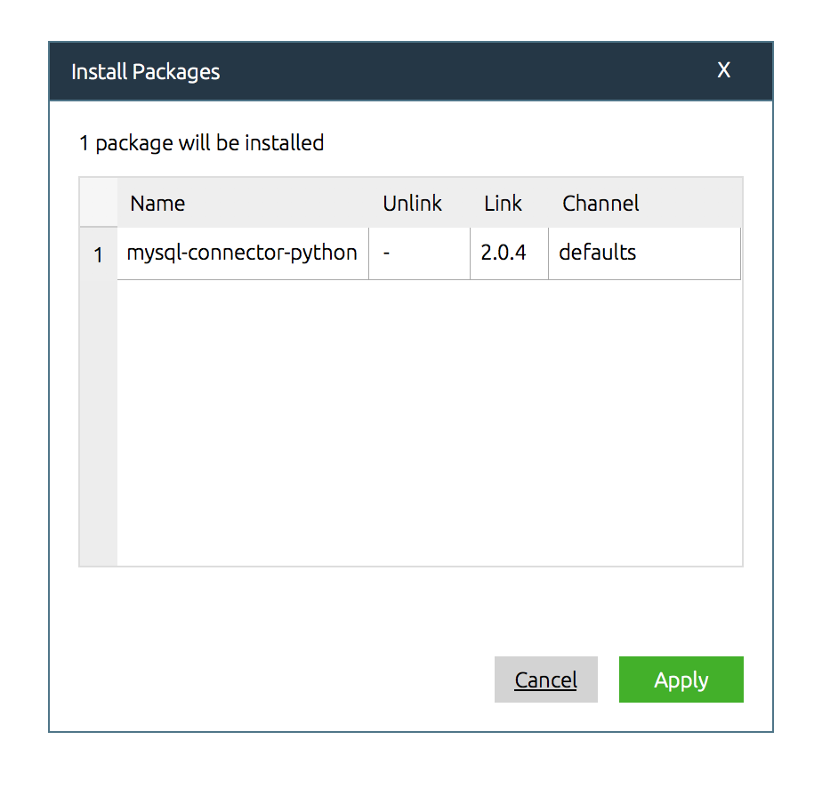


# PythonからMySQLにデータを挿入する

### まずやってみよう

以下のコードを書いて実行

```python
import mysql.connector
```

すると以下の様にエラーになる。これはPythonからMySQLに接続するためのライブラリがないため。

```
ModuleNotFoundError: No module named 'mysql'
```

そこで Python-MySQLドライバのインストールをする必要がある

### Python-MySQLドライバのインストール

1. Anaconda Navigatorを起動→左のタブからEnvironmentsを選択

2. InstalledとなっているプルダウンをAllに変更

3. Search Packagesの欄に「mysql」と入力する

4. mysql-connector-python 　を選択

5. Applyをクリック


install packagesで以下の画面になった準備完了。Applyをクリック



※)以下の様な画面が出た場合は、「Anaconda Navigatorを最新にバージョンアップをしないか？」といってきているので、Noを選択すればOK


### Python-MySQLドライバのインポート

spyderに戻り以下が書かれたプログラムを実行し、エラーが出なければOK

```python
import mysql.connector
```

### PythonからMySQLのテーブルを参照する

```python
# -*- coding: utf-8 -*-
import mysql.connector

# MySQLに接続する
con = mysql.connector.connect(
        host='127.0.0.1',
        db='test',
        user='root',
        password='xxxxx' #設定したパスワードを入れる
    )
cur = con.cursor()

# SQLを実行する
sql = "select * from users"
cur.execute(sql)

# 結果をデータベースから全件取得する
rows = cur.fetchall()

# 表示する
for row in rows:
    print(row)

# データベースからの接続をクローズする
cur.close()
con.close()
```

### PythonからMySQLのテーブルにデータを投入する


```python
# -*- coding: utf-8 -*-
import mysql.connector

# MySQLに接続する
con = mysql.connector.connect(
        host='127.0.0.1',
        db='test',
        user='root',
        password='xxxx' #設定したパスワードを入れる
    )
cur = con.cursor()

# SQLを実行する
sql = "insert into users values(4, 'Yuki Kato', 'F', 15, '1420043', 'yuki@hoge.com')"
cur.execute(sql)

# 変更を確定する
con.commit()

# データベースからの接続をクローズする
cur.close()
con.close()
```

データベースで`SELECT * FROM users`を実行しid=4のレコードが挿入されていることを確認

### 演習5-1

以下のデータをusersテーブルに挿入せよ

```
data_list = [
        {
                'id': 6,
                'name': 'Shigeru Joshima',
                'gender':'M',
                'age':47,
                'zip':'1420001',
                'email':'joshima@hoge.com'
        },
        {
                'id': 7,
                'name': 'Taichi Kokubun',
                'gender':'M',
                'age':43,
                'zip':'1420001',
                'email':'kokubun@hoge.com'
        },
        {
                'id': 8,
                'name': 'Masahiro Matsuoka',
                'gender':'M',
                'age':41,
                'zip':'1420001',
                'email':'matsuoka@hoge.com'
        },
        {
                'id': 9,
                'name': 'Tomoya Nagase',
                'gender':'M',
                'age':39,
                'zip':'1420001',
                'email':'nagase@hoge.com'
        },
]
```


### 演習5-2

演習3-3で取得してた天気予報データをMySQLに挿入せよ

手順
1. データベースに天気予報テーブルを作る
2. 演習3-3のコードを改造して、SQLを生成する
3. SQLを実行する

天気予報テーブルのテーブルは以下のように作る

```sql
CREATE TABLE forcast(
    dt VARCHAR(40),
    temp FLOAT,
    wather VARCHAR(40),
    windspeed FLOAT
);
```

### 演習5-3(時間が余った人)

演習5-2において、時間を表すdtの列はVARCHAR(50)である。これをDATETIME型に変えたテーブルforcast2を作成し、天気予報データを挿入せよ。

