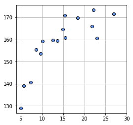
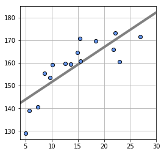

# 演習7 教師あり機械学習（回帰）

## numpyとは

numpyとは、pythonでベクトル計算・行列計算などを簡単にできるようにしたライブラリである。
機械学習ではベクトル計算・行列計算を多用するため、pythonで機械学習を行う場合にはnumpyを使うことがほとんどである。

## numpy のインポート


```python
import numpy as np
```

## ベクトルの演算


```python
a = np.array([1,2,3])
print(a)
```

    [1 2 3]


```python
b = np.array([4,5,6])
print(b)
```

    [4 5 6]


要素同士の和


```python
print(a + b)
```

    [5 7 9]


要素同士の積


```python
print(a * b)
```

    [ 4 10 18]


要素と数値の和


```python
print(a + 5)
```

    [6 7 8]


要素と数値の積


```python
print(a * 5)
```

    [ 5 10 15]


要素の二乗


```python
print(a ** 2)
```

    [1 4 9]


## その他使う機能

各要素の平均


```python
print(np.mean(a))
```

    2.0


各要素の絶対値


```python
print(np.absolute([-4,3]))
```

    [4 3]


要素の平方根


```python
print(np.sqrt([4,3]))
```

    [2.         1.73205081]


## 演習7-1

X = [3,2,1,6,2,4,7]

としたときに、Xの各値に 1を加算し、2乗した配列を表示せよ

## 演習7-2

* 入力値 : X = [2,1,3,8,6,7,4]
* 実測値 : T = [3,4,7,15,12,15,8]
* モデル : Y = 2 * X + 1

とするときに、YモデルとT実測値の平均二乗誤差を求めよ。


# 教師あり機械学習：回帰

今回は、年齢から身長を予測する問題に取り組んでみる。

すなはち

* 入力変数　X：年齢
* 目的変数　T：身長

である

## 学習データの準備


```python
# -*- coding: utf-8 -*-
import numpy as np

# %matplotlib inline

X_MIN = 4
X_MAX = 30

# データを生成して、返却する
def load_data(seed=1):
    np.random.seed(seed)
    X_n = 16
    X = 5 + 25 * np.random.rand(X_n)
    Prm_c = [170,108,0.2]
    T = Prm_c[0] - Prm_c[1] * np.exp(-Prm_c[2] * X) + 4 * np.random.randn(X_n)
    return X,T

# データをグラフに表示する
def show_data(X,T):
    # グラフを図示するライブラリをインポート
    import matplotlib.pyplot as plt
    plt.figure(figsize=(4,4))
    plt.plot(X,T,marker='o',linestyle='None',markeredgecolor='black',color='cornflowerblue')
    plt.xlim(X_MIN, X_MAX)
    plt.grid(True)
    plt.show()

X,T = load_data()

# 入力変数：年齢
print(X)

# 目的変数：身長
print(T)

# 図示する
show_data(X,T)

```

    [15.42555012 23.00811234  5.00285937 12.55831432  8.66889727  7.30846487
      9.65650528 13.63901818 14.91918686 18.47041835 15.47986286 22.13048751
     10.11130624 26.95293591  5.68468983 21.76168775]
    [170.91013145 160.67559882 129.00206616 159.70139552 155.46058905
     140.56134369 153.65466385 159.42939554 164.70423898 169.64527574
     160.71257522 173.28709855 159.31193249 171.51757345 138.9570433
     165.8744074 ]





## 偏微分による勾配の計算


```python
# 上のコードに続けて記載

# w0で偏微分して、勾配を返却する関数
def dmse_line_w0(X,T,w0,w1):
    Y = w0 * X + w1
    return 2 * np.mean((Y-T)*X)

# w1で偏微分して、勾配を返却する関数
def dmse_line_w1(X,T,w0,w1):
    pass
    #(埋めてください)

# w0=10, w1=100 におけるw0軸方向への傾き
print(dmse_line_w0(X,T,10,100))

# w0=10, w1=100 におけるw1軸方向への傾き
print(dmse_line_w1(X,T,10,100))

```

    3171.212773966476
    171.79720516786688

## 演習7-3

w1で偏微分する関数を求めよ

## 勾配法によるモデル計算


```python
# 上のコードに続けて記載

# 勾配法
def fit_line_num(X,T,w0_init,w1_init):
    alpha = 0.001 #学習率。どれくらいちょっとづつ探索するか
    eps = 0.1     #学習の繰り返しをやめる閾値
    #探索を開始する初期値
    w0 = w0_init
    w1 = w1_init
    for i in range(1,1000000):
        # 偏微分して勾配を求める
        d_w0 = dmse_line_w0(X,T,w0,w1)
        d_w1 = dmse_line_w1(X,T,w0,w1)
        # 勾配のほうにちょっと動く
        w0 = w0 - alpha * d_w0
        w1 = w1 - alpha * d_w1
        # 傾きの絶対値の最大値が、しきい値より小さい場合は、終了する
        if max(np.absolute([d_w0,d_w1])) < eps:
            break
    return w0,w1

# 勾配法により、勾配が十分に小さくなるw0,w1を求める
w0,w1 = fit_line_num(X,T,10.0,165.0)

print("求めたモデルは t={0} * x + {1}".format(w0,w1))

```

    求めたモデルは t=1.5399473562672923 * x + 136.1761603274906


## モデルの図示


```python
# 上のコードに続けて記載

# 求めたモデルを図示する
def show_data_and_line(X,T,w0,w1):
    import matplotlib.pyplot as plt
    w=np.array([w0,w1])
    plt.figure(figsize=(4,4))
    xb = np.linspace(X_MIN,X_MAX,100)
    y = w[0] * xb + w[1]
    plt.plot(xb,y,color=(.5,.5,.5), linewidth=4)
    plt.plot(X,T,marker='o',linestyle='None',markeredgecolor='black',color='cornflowerblue')
    plt.xlim(X_MIN, X_MAX)
    plt.grid(True)    
    plt.show()

    
show_data_and_line(X,T,w0,w1)

```





## モデルの評価


```python
# 上のコードに続けて記載

# 評価用データのロード
E_X, E_T = load_data(seed=2)

# モデルの評価
def evaluate(w0,w1,E_X,E_T):
    Y = w0 * E_X + w1
    # 平均二乗誤差の平方根
    return np.sqrt(np.mean((E_T - Y)**2))
    
rmse = evaluate(w0,w1,E_X,E_T)
print("このモデルで見積もられる誤差の大きさは {0} mである".format(rmse))
    
```

    このモデルで見積もられる誤差の大きさは 3.861558873115124 mである


## 予測する


```python
# 上のコードに続けて記載

# 予測する
def predict(x,w0,w1):
    return w0 * x + w1

x = 10
t = predict(x,w0,w1)
print("年齢{0}歳の人は、身長{1}mだろう".format(x,t))
```

    年齢10歳の人は、身長151.57563389016354mだろう

