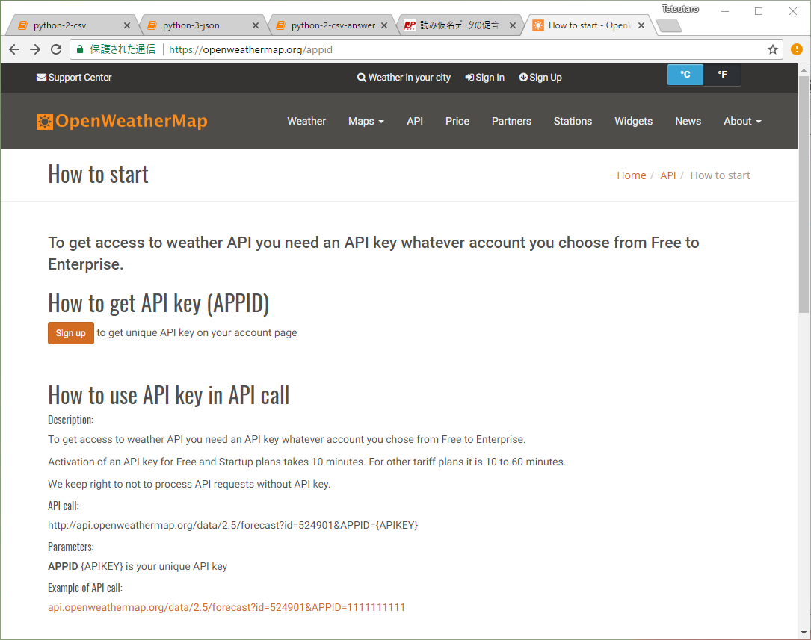
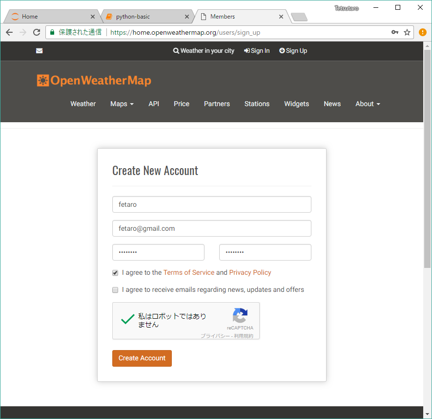


## 事前準備

### 気象情報APIのAPIキーの取得

https://openweathermap.org/price にアクセス



Get API Key and Start をクリック



University of Tokyoを入力し、教育を選ぶ


API Keysのタブを開いてKyesの値をメモする


## ディクショナリの復習


```python
colors = {"carrot":"orange", "tomato": "red", "corn":"yellow" }
print(colors)
print(colors["tomato"])
colors["cucumber"] = "green"
print(colors)
```


```python
## 階層の深いディクショナリ
```


```python
user_dict = {"id":10,
            "name":"watanabe",
            "friend_list" : [12,43,60,31],
             "hobby_list" : [
                {"name":"majong",  "year":25},
                {"name":"karaoke", "year":20},
                {"name":"bicycle", "year":5},
             ]
            }
```


```python
print(user_dict["friend_list"])
print(user_dict["friend_list"][3])
print(user_dict["hobby_list"][2])
print(user_dict["hobby_list"][2]["year"])
```

    [12, 43, 60, 31]
    31
    {'name': 'bicycle', 'year': 5}
    5
    

## APIからデータを取得して表示する


```python
import requests

# ここに自分で取得したAPIのキーの値を入れる
# うまく動かない場合は、渡部のキーをそのまま使ってもまあOK
api_key = "e6bc6cc0169f020add3b459c0c14c71c" 

city = "Tokyo"
response = requests.get("http://api.openweathermap.org/data/2.5/weather?q={0}&appid={1}".format(city,api_key))
print(response.text)
```

    {"coord":{"lon":139.76,"lat":35.68},"weather":[{"id":701,"main":"Mist","description":"mist","icon":"50n"}],"base":"stations","main":{"temp":290.15,"pressure":1019,"humidity":67,"temp_min":289.15,"temp_max":292.15},"visibility":16093,"wind":{"speed":2.1,"deg":50},"clouds":{"all":1},"dt":1524409020,"sys":{"type":1,"id":7622,"message":0.0082,"country":"JP","sunrise":1524340757,"sunset":1524388807},"id":1850147,"name":"Tokyo","cod":200}


## JSONをディクショナリに変換して表示する


```python
# 今までのプログラムに以下を追記
import json   # JSONライブラリをインポート
json_str = response.text
w_dict = json.loads(json_str)
print(w_dict)
```

    {'coord': {'lon': 139.76, 'lat': 35.68}, 'weather': [{'id': 701, 'main': 'Mist', 'description': 'mist', 'icon': '50n'}], 'base': 'stations', 'main': {'temp': 290.15, 'pressure': 1019, 'humidity': 67, 'temp_min': 289.15, 'temp_max': 292.15}, 'visibility': 16093, 'wind': {'speed': 2.1, 'deg': 50}, 'clouds': {'all': 1}, 'dt': 1524409020, 'sys': {'type': 1, 'id': 7622, 'message': 0.0082, 'country': 'JP', 'sunrise': 1524340757, 'sunset': 1524388807}, 'id': 1850147, 'name': 'Tokyo', 'cod': 200}


## ディクショナリをきれいに表示する


```python
# 今までのプログラムに以下を追記
import pprint    # Pretty Printライブラリをインポート
pp = pprint.PrettyPrinter(indent=4)
pp.pprint(w_dict)
```

    {   'base': 'stations',
        'clouds': {'all': 1},
        'cod': 200,
        'coord': {'lat': 35.68, 'lon': 139.76},
        'dt': 1524409020,
        'id': 1850147,
        'main': {   'humidity': 67,
                    'pressure': 1019,
                    'temp': 290.15,
                    'temp_max': 292.15,
                    'temp_min': 289.15},
        'name': 'Tokyo',
        'sys': {   'country': 'JP',
                   'id': 7622,
                   'message': 0.0082,
                   'sunrise': 1524340757,
                   'sunset': 1524388807,
                   'type': 1},
        'visibility': 16093,
        'weather': [   {   'description': 'mist',
                           'icon': '50n',
                           'id': 701,
                           'main': 'Mist'}],
        'wind': {'deg': 50, 'speed': 2.1}}


## 時刻を取得


```python
# 今までのプログラムに以下を追記
unix_time = w_dict["dt"]
print(unix_time)
```

    1524409020


## UNIXタイムを日本時間で解釈して表示


```python
# 今までのプログラムに以下を追記
from datetime import datetime, timezone, timedelta
JST = timezone(timedelta(hours=+9), 'JST')
time = datetime.fromtimestamp(unix_time,  JST)
print(time)
```

    2018-04-22 23:57:00+09:00


## 課題 3-1

時刻、温度、天気、風の強さを取得し、天気予報の日本語文字列を出力せよ

```
出力：2018-04-24 12:00:00+09:00の気温は13.6度、天気はCloud、風の強さは5.1m/sです。
```

ヒント：どこにデータが有るかわからない、データの意味がわからない場合は、データの仕様書 https://openweathermap.org/current を読む

## 課題3-2（時間が余ったら）

天気予報をより流暢な日本語にせよ

出力：4月24日火曜日12時の気温は13度、天気は曇り、風の強さは5.1m/sです。

ヒント：天気の文字列の種類は　https://openweathermap.org/weather-conditions を見る

## 天気予報の取得

天気予報の取得は `https://api.openweathermap.org/data/2.5/forecast` を使う


```python
# APIの呼び出し
import requests
api_key = "e6bc6cc0169f020add3b459c0c14c71c"
city = "Tokyo"
response = requests.get("https://api.openweathermap.org/data/2.5/forecast?q={0}&appid={1}".format(city,api_key))

# データをJSONにする
import json  
json_str = response.text
f_dict = json.loads(json_str)

# 綺麗に表示
import pprint
pp = pprint.PrettyPrinter(indent=4)
pp.pprint(f_dict)
```

    {   'city': {   'coord': {'lat': 35.6828, 'lon': 139.759},
                    'country': 'JP',
                    'id': 1850147,
                    'name': 'Tokyo',
                    'population': 8336599},
        'cnt': 40,
        'cod': '200',
        'list': [   {   'clouds': {'all': 0},
                        'dt': 1524873600,
                        'dt_txt': '2018-04-28 00:00:00',
                        'main': {   'grnd_level': 1023.61,
                                    'humidity': 77,
                                    'pressure': 1023.61,
                                    'sea_level': 1027.38,
                                    'temp': 296.29,
                                    'temp_kf': 3.98,
                                    'temp_max': 296.29,
                                    'temp_min': 292.309},
                        'rain': {},
                        'sys': {'pod': 'd'},
                        'weather': [   {   'description': 'clear sky',
                                           'icon': '01d',
                                           'id': 800,
                                           'main': 'Clear'}],
                        'wind': {'deg': 26.5025, 'speed': 1.81}},
                    {   'clouds': {'all': 32},
                        'dt': 1524884400,
                        'dt_txt': '2018-04-28 03:00:00',
                        'main': {   'grnd_level': 1023.52,
                                    'humidity': 71,
                                    'pressure': 1023.52,
                                    'sea_level': 1027.36,
                                    'temp': 296.75,
                                    'temp_kf': 2.98,
                                    'temp_max': 296.75,
                                    'temp_min': 293.766},
                        'rain': {},
                        'sys': {'pod': 'd'},
                        'weather': [   {   'description': 'scattered clouds',
                                           'icon': '03d',
                                           'id': 802,
                                           'main': 'Clouds'}],
                        'wind': {'deg': 107.502, 'speed': 0.22}},

    

## 気温だけを表示


```python
# 今までのプログラムに以下を追記
w_list = f_dict["list"]
for w_dict in w_list:
    print(w_dict["main"]["temp"])
```

    296.29
    296.75
    295.63
    293.03
    289.808
    289.786
    289.608
    290.277
    293.94
    294.825
    294.837
    293.168
    291.804
    291.31
    290.972
    290.96
    293.867
    294.983
    294.331
    292.533
    291.324
    290.028
    288.078
    288.515
    293.433
    295.814
    296.655
    294.82
    290.977
    289.818
    289.925
    289.47
    291.644
    291.125
    290.306
    289.543
    289.284
    289.129
    289.558
    290.15
    

## 課題3-3
時刻、温度、天気、風の強さの予報を、ダブルクオートで括って、カンマ区切りで表示せよ。

期待する出力

```
"2018-04-28 09:00:00+09:00","23.140000000000043","Clear","1.81"
"2018-04-28 12:00:00+09:00","23.600000000000023","Clouds","0.22"
"2018-04-28 15:00:00+09:00","22.480000000000018","Rain","4.57"
"2018-04-28 18:00:00+09:00","19.879999999999995","Clouds","4.65"
"2018-04-28 21:00:00+09:00","16.658000000000015","Clear","4.71"
"2018-04-29 00:00:00+09:00","16.636000000000024","Clear","4.56"
"2018-04-29 03:00:00+09:00","16.458000000000027","Clear","4.67"
"2018-04-29 06:00:00+09:00","17.12700000000001","Clear","3.76"
"2018-04-29 09:00:00+09:00","20.79000000000002","Rain","4.46"
"2018-04-29 12:00:00+09:00","21.67500000000001","Clear","6.77"
"2018-04-29 15:00:00+09:00","21.687000000000012","Clear","7.52"
"2018-04-29 18:00:00+09:00","20.01800000000003","Clear","7.36"
"2018-04-29 21:00:00+09:00","18.653999999999996","Clear","6.61"
"2018-04-30 00:00:00+09:00","18.160000000000025","Clouds","5.81"
"2018-04-30 03:00:00+09:00","17.822000000000003","Clear","5.16"
"2018-04-30 06:00:00+09:00","17.810000000000002","Clouds","4.91"
"2018-04-30 09:00:00+09:00","20.71700000000004","Clouds","5.42"
"2018-04-30 12:00:00+09:00","21.833000000000027","Clear","6.45"
"2018-04-30 15:00:00+09:00","21.18100000000004","Clouds","6.28"
"2018-04-30 18:00:00+09:00","19.383000000000038","Clouds","5.39"
```

ヒント：ダブルクオート "  をprintしたいときは、文字列をシングルクオート ' で定義する。   print('ここは"大阪"です')

